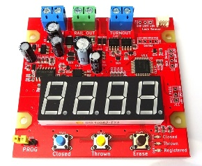

# BiDi Turnout Switch

NMRA DCC 規格のうち、BiDi (RailCom) によって送信される車両のアドレス情報を利用して、接続されているポイント線路を自動的に転換することが可能な装置です。

本リポジトリには、基板設計データとファームウェアが含まれます。

## 開発環境

- KiCad Version (5.1.12)-1
- Microchip Studio Version 7.0.2542
